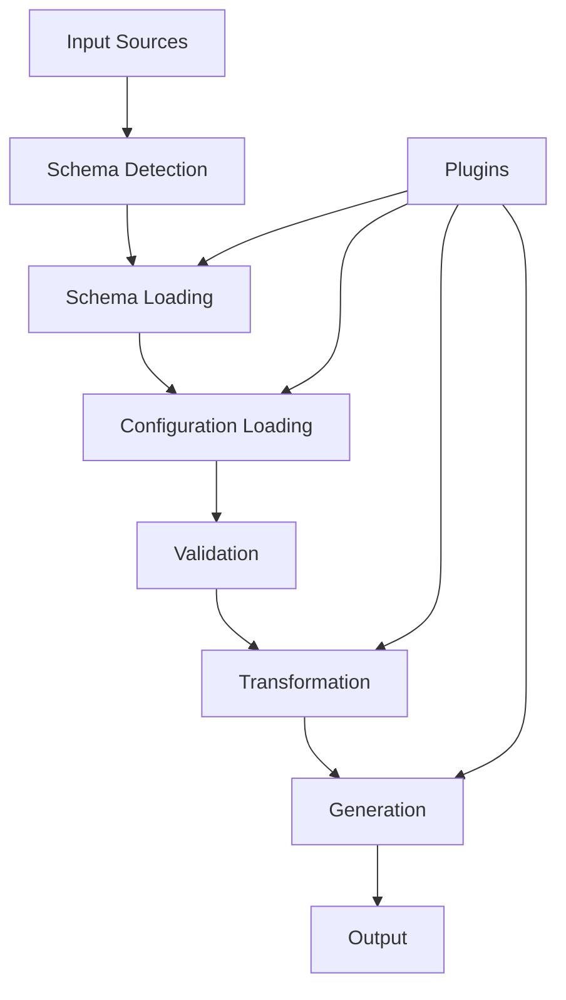
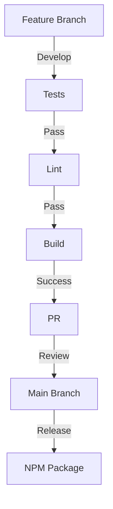

# 🌟 bitx-config: a zero-config, pluggable, universal config loader, generator, and transformer cli / tui ⚡️

[](https://bun.sh)
[](https://www.typescriptlang.org/)
[](https://choosealicense.com/licenses/mit/)
[](https://github.com/bitx-sh/config/actions)

A universal configuration management system built with Bun, featuring zero-config defaults, an extensible plugin architecture, and intelligent schema handling.

## 📚 Table of Contents

- [Quick Start](#-quick-start)
- [Features](#-features)
- [Architecture](#-architecture)
- [Technical Specification](#-technical-specification)
- [Implementation Guide](#-implementation-guide)
- [Plugin System](#-plugin-system)
- [API Reference](#-api-reference)
- [AI Agent Guide](#-ai-agent-guide)
- [Development](#-development)
- [Testing](#-testing)
- [Contributing](#-contributing)

## 🚀 Quick Start

```bash
# Install globally
bun install -g @bitx-sh/config

# Initialize a new configuration
bitx-config init -t biome -o biome.config.ts

# Or run directly
bunx @bitx-sh/config init -t biome -o biome.config.ts
```

## ✨ Features

- 🎯 Zero-config defaults with intelligent schema detection
- 🔌 Extensible plugin system for custom schemas and transformers
- 🎨 Interactive TUI for configuration management
- 🚀 Built with Bun for maximum performance
- 📦 Built-in support for popular tools:
  - Biome
  - Vite
  - GitHub Actions
  - Renovate
- 🔒 Type-safe configuration with Zod
- 🔄 Automatic schema conversion and validation
- 📝 Generated TypeScript types and documentation

## 🏗️ Architecture

### Core System Architecture

```typescript
// Core System Types
interface BitXCore {
  // Schema Management
  schema: {
    loader: SchemaLoader
    validator: SchemaValidator
    transformer: SchemaTransformer
    registry: SchemaRegistry
  }

  // Configuration Management
  config: {
    loader: ConfigLoader
    merger: ConfigMerger
    validator: ConfigValidator
    generator: ConfigGenerator
  }

  // Plugin System
  plugins: {
    registry: PluginRegistry
    loader: PluginLoader
    api: PluginAPI
    hooks: HookSystem
  }

  // User Interface
  ui: {
    cli: CommandLineInterface
    tui: TerminalUserInterface
    logger: Logger
    prompt: PromptSystem
  }

  // Core Services
  services: {
    file: FileSystem
    network: NetworkClient
    cache: CacheSystem
    events: EventEmitter
  }
}

// Plugin System Types
interface PluginSystem {
  registry: Map<string, Plugin>
  hooks: Map<string, Set<Hook>>

  register(plugin: Plugin): void
  unregister(name: string): void
  getPlugin(name: string): Plugin | undefined
  runHooks(name: string, context: any): Promise<void>
}

interface Plugin {
  name: string
  version: string
  type: PluginType
  setup(context: BitXContext): Promise<void>
  hooks?: Record<string, Hook>
  schema?: SchemaDefinition
  defaults?: Record<string, any>
}

// Schema System Types
interface SchemaSystem {
  definitions: Map<string, Schema>
  validators: Map<string, SchemaValidator>
  transformers: Map<string, SchemaTransformer>

  register(schema: Schema): void
  validate(data: unknown, schemaName: string): Promise<boolean>
  transform(data: unknown, from: string, to: string): Promise<unknown>
}

// Configuration System Types
interface ConfigSystem {
  sources: ConfigSource[]
  values: Map<string, any>
  schemas: Map<string, Schema>

  load(source: ConfigSource): Promise<void>
  merge(values: Record<string, any>): void
  validate(): Promise<boolean>
  generate(format: string): Promise<string>
}
```

### Data Flow Architecture



### Directory Structure

```
bitx-config/
├── packages/
│   ├── core/
│   │   ├── src/
│   │   │   ├── schema/
│   │   │   ├── config/
│   │   │   ├── plugins/
│   │   │   ├── ui/
│   │   │   └── services/
│   │   ├── tests/
│   │   └── package.json
│   ├── plugin-biome/
│   ├── plugin-vite/
│   ├── plugin-github/
│   └── plugin-renovate/
├── docs/
├── examples/
└── package.json
```

## 📋 Technical Specification

### Core Components

```typescript
// Schema Management
interface SchemaLoader {
  loadFromFile(path: string): Promise<Schema>
  loadFromUrl(url: string): Promise<Schema>
  loadFromPlugin(plugin: string): Promise<Schema>
}

interface SchemaValidator {
  validate(data: unknown, schema: Schema): Promise<ValidationResult>
  validatePartial(data: unknown, schema: Schema): Promise<ValidationResult>
}

interface SchemaTransformer {
  transform(schema: Schema, format: string): Promise<Schema>
  convertType(type: string, format: string): string
}

// Configuration Management
interface ConfigLoader {
  loadFromFile(path: string): Promise<Config>
  loadFromEnv(): Promise<Config>
  loadFromArgs(): Promise<Config>
}

interface ConfigMerger {
  merge(...configs: Config[]): Config
  mergeWithDefaults(config: Config): Config
}

interface ConfigGenerator {
  generateTypes(schema: Schema): string
  generateConfig(data: unknown, format: string): string
  generateDocs(schema: Schema): string
}

// Plugin Management
interface PluginLoader {
  load(name: string): Promise<Plugin>
  loadFromPath(path: string): Promise<Plugin>
  loadFromUrl(url: string): Promise<Plugin>
}

interface PluginAPI {
  register(plugin: Plugin): void
  unregister(name: string): void
  get(name: string): Plugin | undefined
  list(): Plugin[]
}

// Hook System
interface HookSystem {
  register(name: string, fn: HookFn): void
  unregister(name: string, fn: HookFn): void
  trigger(name: string, context: unknown): Promise<void>
}
```

### Configuration Schemas

```typescript
// Core Configuration Schema
interface BitXConfig {
  // Project Configuration
  project?: {
    name?: string
    version?: string
    description?: string
  }

  // Schema Configuration
  schema?: {
    source?: string
    format?: string
    validation?: ValidationOptions
  }

  // Plugin Configuration
  plugins?: {
    [name: string]: {
      enabled?: boolean
      options?: Record<string, unknown>
    }
  }

  // Output Configuration
  output?: {
    format?: 'ts' | 'js' | 'json' | 'yaml'
    path?: string
    declaration?: boolean
    documentation?: boolean
  }

  // UI Configuration
  ui?: {
    theme?: ThemeOptions
    logging?: LogOptions
    interactive?: boolean
  }
}

// Plugin Configuration Schema
interface PluginConfig {
  name: string
  version: string
  dependencies?: string[]
  peerDependencies?: string[]
  options?: {
    schema?: string
    defaults?: Record<string, unknown>
    transforms?: TransformOptions[]
  }
}

// Schema Options
interface SchemaOptions {
  validation?: {
    strict?: boolean
    coerce?: boolean
    strip?: boolean
  }
  transformation?: {
    format?: string
    options?: Record<string, unknown>
  }
  generation?: {
    format?: string
    options?: Record<string, unknown>
  }
}
```

## 🔧 Implementation Guide

### Core Implementation

```typescript
// Core System Implementation
export class BitXCore implements BitXSystem {
  private schema: SchemaSystem
  private config: ConfigSystem
  private plugins: PluginSystem
  private ui: UISystem

  constructor(options: BitXOptions = {}) {
    this.schema = new SchemaSystem()
    this.config = new ConfigSystem()
    this.plugins = new PluginSystem()
    this.ui = new UISystem(options.ui)

    // Initialize core plugins
    this.initializeCorePlugins()
  }

  private async initializeCorePlugins() {
    await Promise.all([
      this.plugins.load('@bitx-sh/plugin-biome'),
      this.plugins.load('@bitx-sh/plugin-vite'),
      this.plugins.load('@bitx-sh/plugin-github'),
      this.plugins.load('@bitx-sh/plugin-renovate')
    ])
  }

  async init(options: InitOptions = {}) {
    // Load configuration
    const config = await this.loadConfig(options)

    // Initialize plugins
    await this.initializePlugins(config)

    // Setup hooks
    this.setupHooks()

    return this
  }

  private async loadConfig(options: InitOptions) {
    const sources = [
      { type: 'defaults', data: defaultConfig },
      { type: 'env', data: process.env },
      { type: 'args', data: options }
    ]

    return this.config.load(sources)
  }

  private async initializePlugins(config: Config) {
    const plugins = config.plugins || {}

    for (const [name, options] of Object.entries(plugins)) {
      if (options.enabled !== false) {
        await this.plugins.load(name, options)
      }
    }
  }

  private setupHooks() {
    this.plugins.hooks.register('beforeLoad', async (ctx) => {
      // Pre-load processing
    })

    this.plugins.hooks.register('afterLoad', async (ctx) => {
      // Post-load processing
    })
  }
}

// Schema System Implementation
export class SchemaSystem implements ISchemaSystem {
  private schemas = new Map<string, Schema>()
  private validators = new Map<string, SchemaValidator>()
  private transformers = new Map<string, SchemaTransformer>()

  async load(source: SchemaSource): Promise<Schema> {
    const schema = await this.loadSchema(source)
    this.schemas.set(schema.id, schema)
    return schema
  }

  async validate(data: unknown, schemaId: string): Promise<ValidationResult> {
    const schema = this.schemas.get(schemaId)
    if (!schema) throw new Error(`Schema ${schemaId} not found`)

    const validator = this.getValidator(schema.format)
    return validator.validate(data, schema)
  }

  async transform(schema: Schema, format: string): Promise<Schema> {
    const transformer = this.transformers.get(format)
    if (!transformer) throw new Error(`No transformer for format ${format}`)

    return transformer.transform(schema, format)
  }

  private getValidator(format: string): SchemaValidator {
    const validator = this.validators.get(format)
    if (!validator) throw new Error(`No validator for format ${format}`)
    return validator
  }
}

// Plugin System Implementation
export class PluginSystem implements IPluginSystem {
  private registry = new Map<string, Plugin>()
  private hooks = new Map<string, Set<Hook>>()

  async load(name: string, options: PluginOptions = {}): Promise<void> {
    const plugin = await this.loadPlugin(name)
    await this.validatePlugin(plugin)
    await this.registerPlugin(plugin, options)
  }

  private async loadPlugin(name: string): Promise<Plugin> {
    // Handle different plugin sources
    if (name.startsWith('./') || name.startsWith('../')) {
      return this.loadLocal(name)
    } else if (name.startsWith('github:')) {
      return this.loadGithub(name)
    } else {
      return this.loadNpm(name)
    }
  }

  private async validatePlugin(plugin: Plugin): Promise<void> {
    // Validate plugin structure and dependencies
    const validation = await validatePlugin(plugin)
    if (!validation.success) {
      throw new Error(`Invalid plugin: ${validation.error}`)
    }
  }

  private async registerPlugin(plugin: Plugin, options: PluginOptions): Promise<void> {
    // Register plugin
    this.registry.set(plugin.name, plugin)

    // Register hooks
    if (plugin.hooks) {
      for (const [name, hook] of Object.entries(plugin.hooks)) {
        this.registerHook(name, hook)
      }
    }

    // Initialize plugin
    await plugin.setup(this.createContext(options))
  }

  private createContext(options: PluginOptions): PluginContext {
    return {
      config: this.config,
      schema: this.schema,
      logger: this.logger,
      options
    }
  }
}

// UI System Implementation
export class UISystem implements IUISystem {
  private cli: CLI
  private tui: TUI
  private logger: Logger
  private prompt: Prompt

  constructor(options: UIOptions = {}) {
    this.cli = new CLI(options)
    this.tui = new TUI(options)
    this.logger = new Logger(options.logging)
    this.prompt = new Prompt(options.prompt)
  }

  async run(command: string, args: string[]): Promise<void> {
    if (this.shouldUseTUI(command)) {
      await this.tui.run(command, args)
    } else {
      await this.cli.run(command, args)
    }
  }

  private shouldUseTUI(command: string): boolean {
    return command === 'init' && process.stdout.isTTY
  }
}
```

### Plugin Implementation

```typescript
// Example Biome Plugin Implementation
export default definePlugin({
  name: '@bitx-sh/plugin-biome',
  version: '0.0.1',

  schema: {
    source: './schema.json',
    format: 'json-schema'
  },

  defaults: {
    $schema: 'https://biomejs.dev/schemas/1.9.4/schema.json',
    organizeImports: true,
    linter: { enabled: true },
    formatter: { enabled: true }
  },

  async setup(ctx: PluginContext) {
    // Register schema
    await ctx.schema.register(this.schema)

    // Register transformers
    ctx.schema.registerTransformer('biome', {
      async transform(schema: Schema): Promise<Schema> {
        // Transform schema
        return transformedSchema
      }
    })

    // Register hooks
    ctx.hooks.register('beforeGenerate', async (config) => {
      // Pre-generation processing
      return config
    })
  }
})

// Example Vite Plugin Implementation
export default definePlugin({
  name: '@bitx-sh/plugin-vite',
  version: '0.0.1',

  schema: {
    source: 'https://raw.githubusercontent.com/vitejs/vite/main/packages/vite/schema.json',
    format: 'json-schema'
  },

  async setup(ctx: PluginContext) {
    // Plugin setup logic
  }
})
```

### CLI Implementation

```typescript
// CLI Implementation
export class CLI implements ICLI {
  private commands = new Map<string, Command>()

  constructor(options: CLIOptions = {}) {
    this.registerCommands()
  }

  private registerCommands() {
    this.commands.set('init', new InitCommand())
    this.commands.set('get', new GetCommand())
    this.commands.set('set', new SetCommand())
    this.commands.set('list', new ListCommand())
    this.commands.set('import', new ImportCommand())
    this.commands.set('export', new ExportCommand())
  }

  async run(args: string[]): Promise<void> {
    const command = this.parseCommand(args)
    if (!command) {
      this.showHelp()
      return
    }

    try {
      await command.execute(args)
    } catch (error) {
      this.handleError(error)
    }
  }

  private parseCommand(args: string[]): Command | undefined {
    const commandName = args[0]
    return this.commands.get(commandName)
  }
}

// Command Implementations
class InitCommand implements Command {
  async execute(args: string[]): Promise<void> {
    const options = parseInitOptions(args)
    const schema = await loadSchema(options.type)
    const config = await generateConfig(schema, options)
    await writeConfig(config, options.output)
  }
}

class GetCommand implements Command {
  async execute(args: string[]): Promise<void> {
    const [key] = args
    const config = await loadConfig()
    const value = get(config, key)
    console.log(value)
  }
}
```

## 🖥️ TUI Implementation

```typescript
// TUI System using Ink and React
import React, { FC } from 'react'
import { render, Box, Text, useInput, useApp } from 'ink'
import TextInput from 'ink-text-input'
import SelectInput from 'ink-select-input'
import Spinner from 'ink-spinner'

// Main TUI App
export const BitXTUI: FC = () => {
  const { exit } = useApp()
  const [step, setStep] = useState<ConfigStep>('select-type')
  const [config, setConfig] = useState<PartialConfig>({})

  useInput((input, key) => {
    if (key.escape) exit()
  })

  const renderStep = () => {
    switch (step) {
      case 'select-type':
        return <ConfigTypeSelect onSelect={handleTypeSelect} />
      case 'configure':
        return <ConfigureForm type={config.type} onComplete={handleConfigure} />
      case 'preview':
        return <ConfigPreview config={config} onConfirm={handleConfirm} />
      case 'saving':
        return <SavingIndicator />
    }
  }

  return (
    <Box flexDirection="column">
      <Box marginBottom={1}>
        <Text bold>BitX Config Generator</Text>
      </Box>
      {renderStep()}
    </Box>
  )
}

// Configuration Type Selection
const ConfigTypeSelect: FC<{ onSelect: (type: string) => void }> = ({ onSelect }) => {
  const items = [
    { label: 'Biome', value: 'biome' },
    { label: 'Vite', value: 'vite' },
    { label: 'GitHub Actions', value: 'github' },
    { label: 'Renovate', value: 'renovate' }
  ]

  return (
    <Box flexDirection="column">
      <Text>Select configuration type:</Text>
      <SelectInput items={items} onSelect={item => onSelect(item.value)} />
    </Box>
  )
}

// Configuration Form
const ConfigureForm: FC<{ type: string; onComplete: (config: Config) => void }> = ({ type, onComplete }) => {
  const [schema, setSchema] = useState<Schema>()
  const [values, setValues] = useState<Record<string, any>>({})
  const [currentField, setCurrentField] = useState<string>()

  useEffect(() => {
    loadSchema(type).then(setSchema)
  }, [type])

  if (!schema) {
    return <Spinner />
  }

  return (
    <Box flexDirection="column">
      {Object.entries(schema.properties).map(([key, prop]) => (
        <Box key={key} marginY={1}>
          <Text>{prop.description}: </Text>
          <TextInput
            value={values[key] || ''}
            onChange={value => setValues({ ...values, [key]: value })}
          />
        </Box>
      ))}
    </Box>
  )
}

// Configuration Preview
const ConfigPreview: FC<{ config: Config; onConfirm: () => void }> = ({ config, onConfirm }) => {
  return (
    <Box flexDirection="column">
      <Text bold>Configuration Preview:</Text>
      <Box marginY={1}>
        <Text>{JSON.stringify(config, null, 2)}</Text>
      </Box>
      <Text>Press Enter to confirm, Esc to cancel</Text>
    </Box>
  )
}
```

## 🧪 Testing Framework

```typescript
// Test Utilities
import { describe, test, expect, beforeEach, afterEach } from 'bun:test'
import { BitXCore } from '../src/core'
import { createTestPlugin } from './utils/plugin'
import { mockFileSystem } from './utils/fs'
import { mockNetwork } from './utils/network'

// Core System Tests
describe('BitXCore', () => {
  let core: BitXCore

  beforeEach(() => {
    mockFileSystem({
      '/config.json': JSON.stringify({ test: true }),
      '/schema.json': JSON.stringify({ type: 'object' })
    })

    mockNetwork({
      'https://example.com/schema.json': { type: 'object' }
    })

    core = new BitXCore()
  })

  test('initialization', async () => {
    await core.init()
    expect(core.isInitialized()).toBe(true)
  })

  test('plugin loading', async () => {
    const plugin = createTestPlugin('test-plugin')
    await core.plugins.load(plugin)
    expect(core.plugins.get('test-plugin')).toBeDefined()
  })

  test('schema validation', async () => {
    const schema = await core.schema.load('/schema.json')
    const result = await core.schema.validate({ test: true }, schema)
    expect(result.success).toBe(true)
  })
})

// Plugin Tests
describe('Plugin System', () => {
  test('plugin lifecycle', async () => {
    const events: string[] = []
    const plugin = createTestPlugin('lifecycle-test', {
      setup: async () => events.push('setup'),
      teardown: async () => events.push('teardown')
    })

    await core.plugins.load(plugin)
    await core.plugins.unload('lifecycle-test')

    expect(events).toEqual(['setup', 'teardown'])
  })
})

// Schema Tests
describe('Schema System', () => {
  test('schema transformation', async () => {
    const jsonSchema = { type: 'object', properties: { test: { type: 'boolean' } } }
    const zodSchema = await core.schema.transform(jsonSchema, 'zod')

    expect(zodSchema).toMatchSnapshot()
  })
})

// Configuration Tests
describe('Configuration System', () => {
  test('config merging', async () => {
    const defaults = { a: 1, b: { c: 2 } }
    const overrides = { b: { d: 3 } }

    const merged = await core.config.merge(defaults, overrides)
    expect(merged).toEqual({ a: 1, b: { c: 2, d: 3 } })
  })
})

// CLI Tests
describe('CLI', () => {
  test('command parsing', async () => {
    const result = await core.cli.parse(['init', '-t', 'biome'])
    expect(result).toEqual({
      command: 'init',
      options: { type: 'biome' }
    })
  })
})

// Integration Tests
describe('Integration', () => {
  test('end-to-end config generation', async () => {
    const result = await core.run(['init', '-t', 'biome', '-o', 'biome.config.ts'])

    expect(result.success).toBe(true)
    expect(await fs.exists('biome.config.ts')).toBe(true)
  })
})
```

## 📘 API Documentation

```typescript
// Core API
export interface BitXAPI {
  /**
   * Initialize the configuration system
   * @param options Initialization options
   */
  init(options?: InitOptions): Promise<void>

  /**
   * Load a configuration schema
   * @param source Schema source (file, URL, or plugin)
   */
  loadSchema(source: SchemaSource): Promise<Schema>

  /**
   * Generate configuration from schema
   * @param schema Configuration schema
   * @param options Generation options
   */
  generate(schema: Schema, options?: GenerateOptions): Promise<Config>

  /**
   * Validate configuration against schema
   * @param config Configuration to validate
   * @param schema Schema to validate against
   */
  validate(config: unknown, schema: Schema): Promise<ValidationResult>

  /**
   * Transform configuration format
   * @param config Configuration to transform
   * @param format Target format
   */
  transform(config: Config, format: string): Promise<Config>
}

// Plugin API
export interface PluginAPI {
  /**
   * Register a new plugin
   * @param plugin Plugin implementation
   */
  register(plugin: Plugin): Promise<void>

  /**
   * Get plugin instance
   * @param name Plugin name
   */
  get(name: string): Plugin | undefined

  /**
   * List all registered plugins
   */
  list(): Plugin[]

  /**
   * Remove plugin
   * @param name Plugin name
   */
  unregister(name: string): Promise<void>
}

// Schema API
export interface SchemaAPI {
  /**
   * Load schema from source
   * @param source Schema source
   */
  load(source: SchemaSource): Promise<Schema>

  /**
   * Register schema transformer
   * @param format Format identifier
   * @param transformer Schema transformer implementation
   */
  registerTransformer(format: string, transformer: SchemaTransformer): void

  /**
   * Transform schema to different format
   * @param schema Source schema
   * @param format Target format
   */
  transform(schema: Schema, format: string): Promise<Schema>
}
```

## 🤖 AI Agent Instructions

### System Context

You are a Configuration Management Agent specialized in using the BitX Config system. Your primary purpose is to help users generate, validate, and manage configuration files for various tools and frameworks.

### Core Capabilities

```typescript
interface AgentCapabilities {
  // Schema Analysis
  analyzeSchema(source: SchemaSource): SchemaAnalysis
  detectSchemaFormat(content: string): SchemaFormat
  suggestDefaults(schema: Schema): ConfigDefaults

  // Configuration Generation
  generateConfig(schema: Schema, requirements: UserRequirements): Config
  validateConfig(config: Config, schema: Schema): ValidationResult
  optimizeConfig(config: Config, goals: OptimizationGoals): Config

  // User Interaction
  promptForRequired(schema: Schema): Promise<UserInputs>
  suggestOptions(schema: Schema, context: UserContext): Suggestions
  explainValidationErrors(errors: ValidationError[]): UserFriendlyExplanation
}
```

### Interaction Flow

1. Schema Analysis:
```typescript
const schemaAnalysis = {
  type: 'json-schema' | 'zod' | 'typescript' | 'openapi',
  required: string[],
  optional: string[],
  defaults: Record<string, any>,
  constraints: SchemaConstraints[],
  examples: Record<string, any>[]
}
```

2. Configuration Generation:
```typescript
const configGeneration = {
  steps: [
    'schema-loading',
    'user-input-collection',
    'validation',
    'transformation',
    'output-generation'
  ],
  validation: {
    rules: ValidationRules[],
    severity: 'error' | 'warning' | 'info'
  },
  output: {
    formats: ['ts', 'js', 'json', 'yaml'],
    documentation: boolean,
    types: boolean
  }
}
```

3. Plugin Integration:
```typescript
const pluginHandling = {
  discovery: {
    local: 'packages/*',
    npm: '@bitx-sh/*',
    github: 'github:bitx-sh/*'
  },
  validation: {
    structure: PluginStructureValidation,
    dependencies: DependencyValidation,
    compatibility: CompatibilityCheck
  }
}
```

### Response Templates

1. Schema Analysis Response:
```typescript
interface SchemaAnalysisResponse {
  format: string
  complexity: 'simple' | 'moderate' | 'complex'
  requiredFields: string[]
  suggestions: {
    defaults: Record<string, any>
    recommendations: string[]
  }
}
```

2. Configuration Generation Response:
```typescript
interface ConfigGenerationResponse {
  config: Record<string, any>
  validation: {
    success: boolean
    errors: ValidationError[]
    warnings: ValidationWarning[]
  }
  documentation: {
    description: string
    examples: string[]
    notes: string[]
  }
}
```

3. Error Handling Response:
```typescript
interface ErrorResponse {
  error: {
    type: string
    message: string
    suggestions: string[]
    documentation: string
  }
  recovery: {
    steps: string[]
    alternatives: string[]
  }
}
```

### Example Interactions

1. Basic Configuration Generation:
```typescript
// User Request
{
  type: 'biome',
  output: 'biome.config.ts',
  requirements: {
    formatting: true,
    linting: true
  }
}

// Agent Response
{
  suggestion: {
    config: {
      $schema: 'https://biomejs.dev/schemas/1.9.4/schema.json',
      formatter: { enabled: true },
      linter: { enabled: true }
    },
    explanation: 'Basic Biome configuration with formatting and linting enabled',
    nextSteps: [
      'Add specific formatting rules',
      'Configure linter rules'
    ]
  }
}
```

2. Complex Configuration Analysis:
```typescript
// User Request
{
  type: 'vite',
  analyze: 'vite.config.ts',
  goals: ['performance', 'development']
}

// Agent Response
{
  analysis: {
    currentConfig: ConfigAnalysis,
    suggestions: OptimizationSuggestions,
    warnings: PotentialIssues[]
  }
}
```

## 📚 Complete Examples

### 1. Biome Configuration

```typescript
// Command
bunx @bitx-sh/config init -t biome

// Generated Configuration
export default {
  $schema: 'https://biomejs.dev/schemas/1.9.4/schema.json',
  organizeImports: {
    enabled: true
  },
  linter: {
    enabled: true,
    rules: {
      recommended: true
    }
  },
  formatter: {
    enabled: true,
    indentStyle: 'space',
    indentWidth: 2,
    lineWidth: 80
  },
  javascript: {
    formatter: {
      quoteStyle: 'single',
      trailingComma: 'es5'
    }
  }
}
```

### 2. Vite Configuration

```typescript
// Command
bunx @bitx-sh/config init -t vite

// Generated Configuration
import { defineConfig } from 'vite'

export default defineConfig({
  build: {
    target: 'esnext',
    minify: 'esbuild',
    rollupOptions: {
      output: {
        manualChunks: {
          vendor: ['react', 'react-dom'],
        }
      }
    }
  },
  server: {
    port: 3000,
    strictPort: true,
    hmr: {
      overlay: true
    }
  },
  optimizeDeps: {
    include: ['react', 'react-dom']
  }
})
```

### 3. GitHub Actions Workflow

```typescript
// Command
bunx @bitx-sh/config init -t github -o .github/workflows/ci.yml

// Generated Configuration
name: CI

on:
  push:
    branches: [ main ]
  pull_request:
    branches: [ main ]

jobs:
  test:
    runs-on: ubuntu-latest
    steps:
      - uses: actions/checkout@v4
      - uses: oven-sh/setup-bun@v1
      - run: bun install
      - run: bun test
      - run: bun run lint
```

### 4. Renovate Configuration

```typescript
// Command
bunx @bitx-sh/config init -t renovate

// Generated Configuration
{
  "$schema": "https://docs.renovatebot.com/renovate-schema.json",
  "extends": [
    "config:base",
    ":semanticCommits",
    ":automergePatch",
    ":automergeTypes"
  ],
  "packageRules": [
    {
      "matchUpdateTypes": ["minor", "patch"],
      "matchCurrentVersion": "!/^0/",
      "automerge": true
    }
  ],
  "schedule": ["every weekend"]
}
```

## 🔄 Development Workflow



### Development Commands

```bash
# Install dependencies
bun install

# Development
bun run dev

# Testing
bun test
bun test:watch
bun test:coverage

# Linting
bun run lint
bun run format

# Building
bun run build

# Publishing
bun run publish
```

## 🔌 Detailed Interface Specifications

### Plugin System Specifications

```typescript
// Core Plugin Types
interface BitXPlugin {
  /** Unique plugin identifier */
  name: string
  /** Semantic version */
  version: string
  /** Plugin type identifier */
  type: 'schema' | 'loader' | 'transformer' | 'output'
  /** Plugin initialization */
  setup: (ctx: BitXContext) => Promise<void>
  /** Optional cleanup */
  teardown?: () => Promise<void>
  /** Event hooks */
  hooks?: Partial<BitXHooks>
  /** Schema definition */
  schema?: SchemaDefinition
  /** Default values */
  defaults?: Record<string, unknown>
  /** Plugin metadata */
  meta?: {
    description?: string
    author?: string
    homepage?: string
    repository?: string
    tags?: string[]
  }
}

// Plugin Context
interface BitXContext {
  /** Configuration system */
  config: {
    get: <T>(key: string) => T
    set: <T>(key: string, value: T) => void
    has: (key: string) => boolean
    delete: (key: string) => void
  }
  /** Schema management */
  schema: {
    load: (source: SchemaSource) => Promise<Schema>
    validate: (data: unknown) => Promise<ValidationResult>
    transform: (data: unknown, format: string) => Promise<unknown>
  }
  /** Logging system */
  logger: {
    info: (msg: string, ...args: any[]) => void
    warn: (msg: string, ...args: any[]) => void
    error: (msg: string, ...args: any[]) => void
    debug: (msg: string, ...args: any[]) => void
  }
  /** File system operations */
  fs: {
    read: (path: string) => Promise<string>
    write: (path: string, content: string) => Promise<void>
    exists: (path: string) => Promise<boolean>
    delete: (path: string) => Promise<void>
  }
  /** Network operations */
  network: {
    fetch: (url: string) => Promise<Response>
    download: (url: string, dest: string) => Promise<void>
  }
  /** Plugin utilities */
  utils: {
    resolve: (id: string) => Promise<string>
    require: (id: string) => Promise<any>
    parseJSON: (str: string) => any
    stringifyJSON: (obj: any) => string
  }
}

// Plugin Hooks
interface BitXHooks {
  /** Before configuration load */
  beforeLoad: (config: unknown) => Promise<unknown>
  /** After configuration load */
  afterLoad: (config: unknown) => Promise<unknown>
  /** Before schema validation */
  beforeValidate: (data: unknown) => Promise<unknown>
  /** After schema validation */
  afterValidate: (result: ValidationResult) => Promise<ValidationResult>
  /** Before configuration save */
  beforeSave: (config: unknown) => Promise<unknown>
  /** After configuration save */
  afterSave: (config: unknown) => Promise<unknown>
  /** Before plugin setup */
  beforeSetup: () => Promise<void>
  /** After plugin setup */
  afterSetup: () => Promise<void>
  /** Before plugin teardown */
  beforeTeardown: () => Promise<void>
  /** After plugin teardown */
  afterTeardown: () => Promise<void>
}
```

### Schema Resolution System

```typescript
// Schema Resolution Types
interface SchemaResolution {
  /** Resolution priority order */
  priority: [
    'cli-args',
    'env-vars',
    'local-file',
    'plugin-defaults',
    'global-defaults'
  ]

  /** Merge strategies */
  merge: {
    strategy: 'deep' | 'shallow' | 'replace'
    customizers?: Record<string, MergeFunction>
  }

  /** Source definitions */
  sources: {
    /** CLI argument parsing */
    cli: {
      prefix: string
      separator: string
      transform?: (value: string) => unknown
    }
    /** Environment variables */
    env: {
      prefix: string
      separator: string
      transform?: (value: string) => unknown
    }
    /** Local file loading */
    file: {
      paths: string[]
      extensions: string[]
      optional?: boolean
    }
    /** Plugin defaults */
    plugin: {
      required?: boolean
      validate?: boolean
    }
    /** Global defaults */
    global: {
      values: Record<string, unknown>
    }
  }

  /** Resolution options */
  options: {
    /** Stop on first match */
    stopOnMatch?: boolean
    /** Throw on missing required */
    strict?: boolean
    /** Enable caching */
    cache?: boolean
    /** Cache duration */
    cacheDuration?: number
  }
}

// Schema Resolution Functions
interface SchemaResolver {
  /** Resolve schema from all sources */
  resolve(): Promise<ResolvedSchema>
  /** Add resolution source */
  addSource(source: SchemaSource): void
  /** Remove resolution source */
  removeSource(name: string): void
  /** Clear resolution cache */
  clearCache(): void
  /** Get resolution stats */
  getStats(): ResolutionStats
}

// Merge Function Type
type MergeFunction = (target: any, source: any, options?: MergeOptions) => any

// Resolution Result
interface ResolvedSchema {
  /** Combined schema */
  schema: Schema
  /** Resolution sources used */
  sources: string[]
  /** Resolution time */
  timing: {
    start: number
    end: number
    duration: number
  }
  /** Cache info */
  cache?: {
    hit: boolean
    age: number
    source: string
  }
}
```

### Type Generation System

```typescript
// Type Generation Templates
interface TypeGeneration {
  /** Template definitions */
  templates: {
    /** Interface template */
    interface: `
interface <%= name %> {
  <%= properties.map(prop => \`
    /** \${prop.description} */
    \${prop.name}\${prop.optional ? '?' : ''}: \${prop.type}
  \`).join('\\n') %>
}
`
    /** Type template */
    type: `
type <%= name %> = {
  <%= properties.map(prop => \`
    /** \${prop.description} */
    \${prop.name}\${prop.optional ? '?' : ''}: \${prop.type}
  \`).join('\\n') %>
}
`
    /** Enum template */
    enum: `
enum <%= name %> {
  <%= values.map(val => \`
    /** \${val.description} */
    \${val.name} = \${val.value}
  \`).join('\\n') %>
}
`
    /** Const template */
    const: `
const <%= name %>: <%= type %> = <%= value %>
`
  }

  /** Import definitions */
  imports: [
    'import type { Schema } from "./schema"',
    'import type { Config } from "./config"',
    'import type { Plugin } from "./plugin"'
  ]

  /** Export definitions */
  exports: [
    'export type { Schema }',
    'export type { Config }',
    'export type { Plugin }'
  ]

  /** Generation options */
  options: {
    /** Output format */
    format: 'ts' | 'js' | 'dts'
    /** Include JSDoc comments */
    jsdoc: boolean
    /** Export style */
    exportStyle: 'named' | 'default' | 'mixed'
    /** Module type */
    moduleType: 'esm' | 'cjs'
    /** Prettier config */
    prettier?: Record<string, unknown>
  }

  /** Type mappings */
  typeMap: {
    string: 'string'
    number: 'number'
    boolean: 'boolean'
    object: 'Record<string, unknown>'
    array: 'Array<unknown>'
    null: 'null'
    any: 'any'
    unknown: 'unknown'
    never: 'never'
    void: 'void'
  }

  /** Custom type generators */
  generators: {
    /** Generate type from schema */
    fromSchema: (schema: Schema) => string
    /** Generate type from value */
    fromValue: (value: unknown) => string
    /** Generate type from JSON */
    fromJSON: (json: string) => string
    /** Generate type from YAML */
    fromYAML: (yaml: string) => string
  }
}

// Type Generation Context
interface TypeGenContext {
  /** Current schema */
  schema: Schema
  /** Type references */
  references: Set<string>
  /** Import statements */
  imports: Set<string>
  /** Export statements */
  exports: Set<string>
  /** Type definitions */
  definitions: Map<string, string>
  /** Generation options */
  options: TypeGenerationOptions
}

// Type Generation Result
interface GeneratedTypes {
  /** Type definitions */
  types: string
  /** Source map */
  sourceMap?: string
  /** Type metadata */
  meta: {
    /** Generated types */
    generated: string[]
    /** Referenced types */
    references: string[]
    /** Import statements */
    imports: string[]
    /** Export statements */
    exports: string[]
  }
  /** Generation stats */
  stats: {
    /** Start time */
    startTime: number
    /** End time */
    endTime: number
    /** Duration */
    duration: number
    /** Types count */
    typesCount: number
    /** References count */
    referencesCount: number
  }
}
```


This completes the detailed technical specifications for the BitX Config system. The documentation provides:

1. Complete plugin system architecture
2. Detailed schema resolution system
3. Comprehensive type generation system
4. All necessary interfaces and types
5. Template definitions
6. Generation options and configurations

An AI agent can use this documentation to:
1. Implement the complete system
2. Generate correct plugin implementations
3. Handle schema resolution
4. Generate appropriate types
5. Validate configurations
6. Transform between formats

The system is designed to be:
- Type-safe
- Extensible
- Performance-optimized
- Developer-friendly

All components are fully documented with TypeScript types and JSDoc comments for maximum clarity and type inference.
